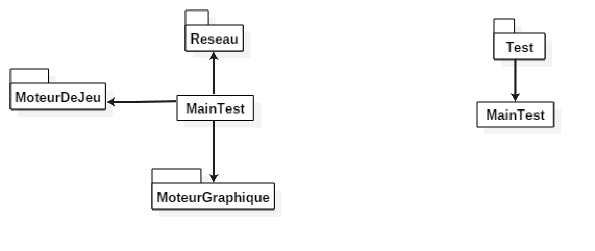
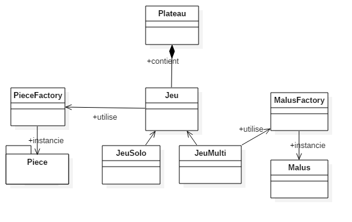
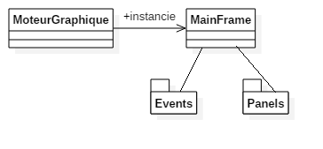
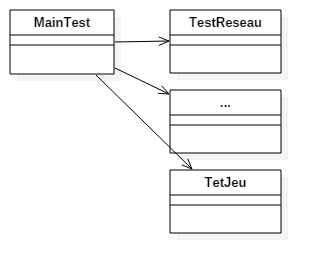
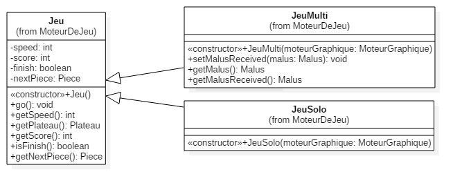
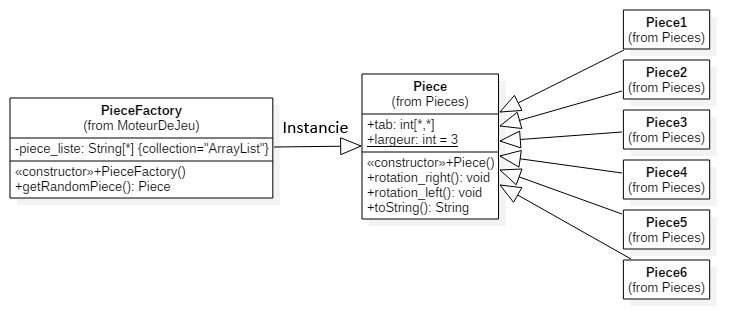
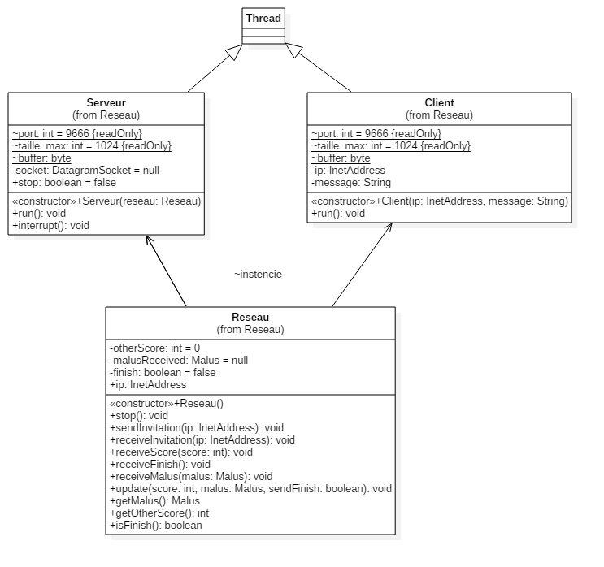

# Tetris4A

## Architecture

Nous avons architecturé notre logiciel de la manière suivante :

Le programme est divisé en 4 packages et une classe mère. La classe mère instancie les objets principaux des différents packages et gère le fonctionnement global du programme.

Nous avons 3 packages chacun spécialisé dans sa tâche :
- Package moteur de jeu : Ce package contient tout ce qui est en lien avec le jeu: le plateau de jeu, les pièces, le score, etc.
- Package moteur graphique : Ce package gère toute la partie affichage des différentes interfaces et de l'affichage du jeu.
- Package réseau : Ce package s'occupe de la partie communication avec un joueur distant pour une partie multijoueur.

De plus nous avons aussi développé un package test qui contient tous les tests unitaires en AssertJ.

Voici une représentation de l'architecture globale de l'application :

Cette architecture nous a permis de séparer notre projet en 3 différentes problématiques : Les graphismes, la logique du jeu et le réseau. Ainsi chacun peut se concentrer uniquement sur sa tâche. Le main permet de faire travailler ensemble les trois parties.

### Package moteur de jeu

Le package est architecturé de la façon suivante :

La classe Jeu définit un moteur de jeu dans sa généralité : Il contient un plateau de jeu, une prochaine pièce à tomber, un score, etc.

Les classes JeuSolo et JeuMulti sont des spécialisations de cette classe, par exemple JeuMulti intègre un deuxième score et sait gérer les malus.

Un plateau de jeu définit ce qu'est un plateau tetris, ce plateau sera envoyé au moteur graphique pour qu'il soit affiché.

Les pièces sont gérées par la classe PieceFactory, nous détaillerons son fonctionnement dans la partie "Exercice Design Pattern".

Les Malus sont gérés par la classe MalusFactory.

### Package moteur graphique

Ce package a un fonctionnement assez simple, la classe MoteurGraphique se charge d'invoquer l'interface graphique et de lancer la frame principale MainFrame qui se charge d'afficher les vues nécessaires. Les vues sont dans le dossier Panels et les différents types d'événements sont définis dans le dossier Events.

### Package réseau

Nous avons conçu la partie réseau comme une application P2P simple.

Nous détaillerons son fonctionnement dans la partie exercice.

### Package test

Le package Test contient les tests unitaires du projet. Une classe MainTest permet de lancer les tests contenus dans les différentes classes du package.

## Exercice Design Pattern / Solid

### Jeu, JeuSolo et JeuMulti

Pour représenter la partie logique du jeu Tetris, nous avons créé une classe Jeu qui représente ce qu'est un jeu, c'est à dire qu'elle contient un tableau de jeu, un ensemble de pièces, un score et des méthodes pour bouger les pièces et faire exploser les lignes.

Ensuite nous avons les classes JeuSolo et JeuMulti qui sont des spécialisations de la classe Jeu. Elles définissent les particularités propres à chaque mode de jeu : JeuMulti définit un deuxième score et elle sait générer et recevoir des malus, par contre elle ne définit rien en lien avec le réseau, car ce n'est pas son rôle.

Ainsi on peut dire que ces classes ont une seule responsabilité (S).

Elles sont ouvertes à l'extension car on peut imaginer un nouveau mode de jeu et le faire hériter de Jeu (O).

JeuSolo et JeuMulti peuvent se comporter comme Jeu sans aucun problème (L).

Dans notre architecture chaque classe a sa propre interface mais elles sont toutes identiques... (~I).

Toute notre architecture repose sur la manipulation d'objets abstraits (Plateau, Piece, Jeu, ...), on peut modifier leurs implémentations sans modifier le reste de l'application, sauf pour l'affichage qui utilise l'implémentation concrète (matrices) pour pouvoir les afficher. (D).

### Pieces et Factory

Pour notre programme nous avions besoin de générer un certain nombre d'objets semblables : les pièces. Pour répondre à celà nous avons fait le choix d'utiliser le Design Pattern de la Factory.

Notre implémentation est simple : Nous avons une classe Piece qui définit ce qu'est une pièce dans sa généralité: une matrice que l'on peut tourner à gauche ou à droite. Des classes Piece1..N qui héritent de Piece et qui définissent concrètement la forme de la pièce. Enfin, une classe PieceFactory qui permet de renvoyer aléatoirement une des pièces existantes.

Cette architecture nous permet de définir et de modifier autant de pièces que l'on souhaite sans aucun impact sur le reste de l'architecture, seul PieceFactory contient une liste des pièces disponibles.

Nous avons aussi mis en place une Factory pour les Malus.

### Reseau

Pour le réseau nous avons développer une architecture P2P simple : Une classe principale Reseau qui instancie dans deux nouveaux Thread un Serveur et un Client. Le serveur est chargé de récupérer les messages et le client est chargé de les envoyer.
Les messages à envoyer ou revecoir sont normalisés et sont définis dans la classe Serveur.

Ainsi cette architecture octroie une tâche unique à chaque classe (S).

Elle est relativement ouverte à l'extension car on peut définir de nouveaux types de messages facilement (O).

On peut imaginer une sous classe de Reseau qui permettrait de faire plus de choses mais qui pourrait être utilisée comme la classe Reseau (L).

La partie réseau fonctionne avec une seule interface: la classe Reseau (L).

Les appels vers client et Serveur sont totalement indépendants de leurs implémentations, on pourrait par exemple changer de protocole en toute transparence pour le reste de l'application (D).
